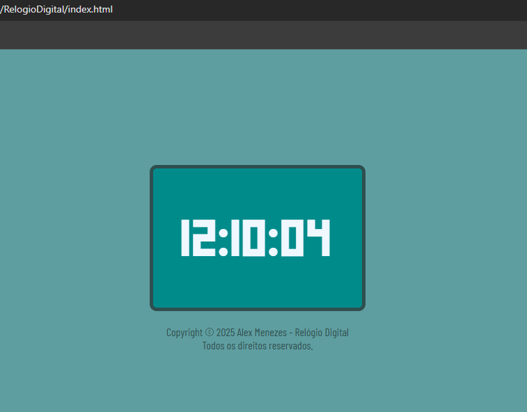

# 🕒 Relógio Digital
  
Desenvolvido por [Alex Menezes](https://github.com/alexssmenezes) como exercício de prática e aprendizado.

---

## 📸 Preview

 <!-- Substitua pelo caminho correto da imagem, se quiser incluir uma captura de tela -->

---

## 🚀 Funcionalidades

- Exibe o horário atual em tempo real
- Atualização automática a cada segundo
- Design responsivo e centralizado
- Tipografia personalizada com Google Fonts

---

## 🛠️ Tecnologias Utilizadas

- HTML5
- CSS3
- JavaScript (ES6)
- Google Fonts (`Barlow Condensed`, `Qahiri`)

---

## 📁 Estrutura de Arquivos

RelogioDigital/

- ├── index.html
- ├── style.css
- ├── script.js
- ├── README.md
- └── assets/
- ---└── print.png

---

## 📦 Como Usar

1. Clone o repositório:

   ```bash
   git clone https://github.com/alexssmenezes/RelogioDigital.git
    ```

2. Abra o arquivo index.html em seu navegador.

---

## 🧠 Aprendizados

- Este projeto foi uma oportunidade para praticar:
- Manipulação de DOM com JavaScript
- Formatação de tempo com zero à esquerda
- Uso de Flexbox para centralização
- Aplicação de fontes externas via Google Fonts

---

## ⚖️ Licença uso livre

- Uso livre para fins de estudos e práticar programação.
- Este projeto está licenciado sob os termos da Licença MIT.
- Copyright © 2025 Alex Menezes - Relógio Digital. Todos os direitos reservados.

---

Feito com 💙 por Alex Menezes

- Você pode personalizar o link do seu perfil, adicionar uma imagem de preview se quiser, e ajustar a licença conforme sua preferência.
